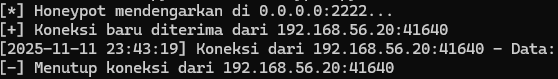

# SimplePySSH - Honeypot SSH Sederhana

Sebuah honeypot SSH *low-interaction* sederhana yang ditulis dengan Python. Dibuat untuk tujuan edukasi dan untuk mengamati serta mencatat upaya koneksi *brute-force* otomatis yang ada di internet.

---

## ⚠️ Peringatan Keamanan

**JANGAN PERNAH** menjalankan ini di mesin produksi, jaringan kantor/kampus, atau jaringan apa pun yang tidak terisolasi. Gunakan **HANYA** di dalam lingkungan yang aman dan terisolasi seperti:
* **Virtual Machine (VM)** dengan pengaturan jaringan "NAT" atau "Host-Only".
* **Container Docker.**
* Perangkat keras terpisah (seperti Raspberry Pi) yang tidak terhubung ke jaringan utama Anda.

Penulis tidak bertanggung jawab atas penyalahgunaan atau kerusakan apa pun yang disebabkan oleh skrip ini.

---

## ✨ Fitur

* **Simulasi SSH:** Mengirimkan *banner* SSH palsu (`SSH-2.0-OpenSSH_8.2p1`) untuk menipu *scanner*.
* **Pencatatan (Logging):** Mencatat semua IP, *port*, dan data yang dikirim oleh penyerang (seperti *username* dan *password*) ke dalam file `honeypot.log`.
* **Respons Palsu:** Mengirim pesan `Password authentication failed.` palsu sebelum menutup koneksi.
* **Multi-threaded:** Mampu menangani beberapa koneksi penyerang secara bersamaan tanpa *crash*.

---

## 🚀 Instalasi & Cara Menjalankan

Anda hanya memerlukan Python 3, yang sudah terinstal di sebagian besar sistem Linux modern.

1.  **Clone repositori ini:**
    ```bash
    git clone https://github.com/oninonins/Simple-python-ssh-honeypot.git
    cd Simple-python-ssh-honeypot
    ```

2.  **Jalankan honeypot (di dalam VM Anda):**
    ```bash
    python3 ssh_honeypot.py
    ```

3.  Server akan berjalan dan mendengarkan di port `2222`.
    ```
    [*] Honeypot mendengarkan di 0.0.0.0:2222...
    ```

---

## 📸 Contoh Hasil

Ini adalah contoh apa yang akan Anda lihat saat honeypot berjalan dan ada yang mencoba terhubung.

**Terminal Server (Honeypot):**
Mencatat koneksi baru, data yang dikirim, dan penutupan koneksi.


**Terminal Klien (Penyerang):**
Penyerang melihat *banner* SSH palsu, mencoba mengirim data, dan kemudian koneksinya ditolak.


---

## 📄 Lisensi

Proyek ini dilisensikan di bawah Lisensi MIT. Lihat file `LICENSE` untuk detailnya.

Copyright (c) 2025 Farrelino Athaillah Ribera